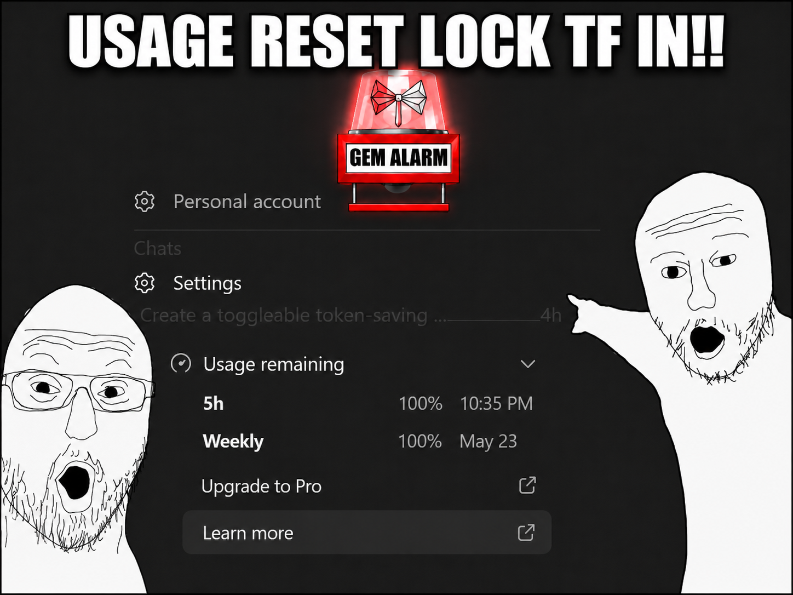

# Codex Limit Watcher

Unofficial Windows-first local watcher for Codex usage limits. It uses the local Codex app-server endpoint to alert when your limits are reset.



This is not OpenAI software and is not endorsed or supported by OpenAI.

## Requirements

- Windows
- Node.js and npm
- Codex installed and signed in
- Local Codex app-server available through Codex

## Quick Start

Download or clone this repo, then double-click:

1. `Setup.bat`
2. `Configure Watcher.bat`
3. `Test Notification.bat`
4. `Start Watcher Hidden.bat`
5. `Watcher Status.bat`
6. `Stop Watcher.bat`
7. Optional: `Setup Autostart.bat`
8. Optional: `Remove Autostart.bat`

`Setup.bat` creates `config.json` if needed, installs npm packages if needed, and runs a notification check.

## Launcher Order

Use `Setup.bat` first. Use `Configure Watcher.bat` to change notification settings. Use `Test Notification.bat` before starting the watcher. Use `Start Watcher Hidden.bat` for normal background mode. Use `Watcher Status.bat` to check it and `Stop Watcher.bat` to stop it.

Autostart is optional. `Setup Autostart.bat` creates a current-user Windows Task Scheduler entry. `Remove Autostart.bat` removes it. It does not require admin.

## Change Sound Or Billboard Image

Easiest path: run `Configure Watcher.bat`, choose the sound file or billboard image option, then paste a relative or absolute path.

Recommended custom sound location:

```text
assets/sounds/my-alert.wav
```

Recommended custom image location:

```text
assets/billboards/my-billboard.png
```

Missing custom paths warn instead of crashing, so you can save the path and add the file later.

## Useful Commands

```powershell
npm run diagnose:notifications
```

```powershell
npm run test:billboard
```

```powershell
npm run status
```

```powershell
npm run background:start
```

```powershell
npm run background:stop
```

```powershell
npm run test:log-rotation
```

## Troubleshooting

If notifications do not work, run:

```powershell
npm run diagnose:notifications
```

If the watcher will not start hidden, run:

```powershell
npm run background:start
npm run status
```

If the app-server or quota check fails, open Codex and make sure you are signed in.

If the billboard looks wrong, run:

```powershell
npm run test:billboard
```

If `config.json` gets messed up, run `Configure Watcher.bat` and restore from a backup.

Logs are in `logs/`. The default app log rotates at 2 MB and keeps `codex-limit-watcher.log.1` through `codex-limit-watcher.log.4`.

## Known Limitations

- Windows-first.
- Unofficial project.
- Depends on the local Codex app-server endpoint being available.
- If Codex changes the local endpoint or response shape, this tool may need an update.
- Does not scrape the ChatGPT web UI.
- Does not OCR screenshots.
- Notifications depend on local Windows notification and media support.
- Missing custom sound or image paths warn instead of crashing.
